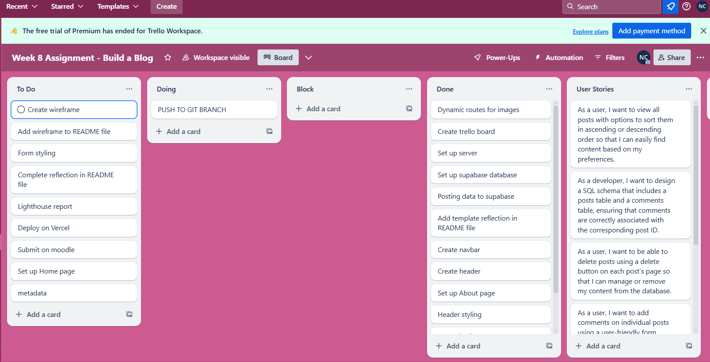

Reflection

WIREFRAME:

TRELLO:

GITHUB:
VERCEL:

SUPABASE SCHEMA:

---

## 🎯 What requirements did you achieve?

- COMPLETE - Display all posts on the page
- COMPLETE - Display posts with an option to sort them in ascending or descending order.
- COMPLETE - Create a SQL schema for a posts table and a comments table, with the comments being connected to the posts table with a foreign key.
- Create a delete button on posts that allows users to delete the post from the database.
- COMPLETE - Create a form which saves comments to a dedicated comments table
- Create a form where the comments being connected to the posts table with a foreign key.
- Allow users to comment on individual posts in their dynamic routes. Comments should be associated with posts, and have a dynamic route (e.g. /posts/:postid).
- COMPLETE - Add a redirect when a user creates a post to redirect them to the posts page.

---

## 🎯 Were there any requirements or goals that you were unable to achieve?

1. Changing the favicon, couldn't get it to work --> used this for reference: https://www.geeksforgeeks.org/how-to-add-a-favicon-to-a-next-js-static-site/

2.

3.

---

## 🎯 If so, what was it that you found difficult about these tasks?

----Requesting feedback about a specific part of your submission.

----What useful external sources helped you complete the assignment (e.g Youtube tutorials)?
https://www.geeksforgeeks.org/how-to-add-a-favicon-to-a-next-js-static-site/
https://coolors.co/palettes/popular
unsplash.com
https://medium.com/@a.pirus/how-to-create-a-responsive-navigation-bar-in-next-js-13-e5540789a017
https://nextjs.org/docs/pages/building-your-application/routing/linking-and-navigating
https://nextjs.org/docs/pages/building-your-application/routing/dynamic-routes

----What errors or bugs did you encounter while completing your assignment? How did you solve them?

----What went really well and what could have gone better?

You can start editing the page by modifying `app/page.js`. The page auto-updates as you edit the file.

This project uses [`next/font`](https://nextjs.org/docs/app/building-your-application/optimizing/fonts) to automatically optimize and load [Geist](https://vercel.com/font), a new font family for Vercel.

## Learn More

To learn more about Next.js, take a look at the following resources:

- [Next.js Documentation](https://nextjs.org/docs) - learn about Next.js features and API.
- [Learn Next.js](https://nextjs.org/learn) - an interactive Next.js tutorial.

You can check out [the Next.js GitHub repository](https://github.com/vercel/next.js) - your feedback and contributions are welcome!

## Deploy on Vercel

The easiest way to deploy your Next.js app is to use the [Vercel Platform](https://vercel.com/new?utm_medium=default-template&filter=next.js&utm_source=create-next-app&utm_campaign=create-next-app-readme) from the creators of Next.js.

Check out our [Next.js deployment documentation](https://nextjs.org/docs/app/building-your-application/deploying) for more details.
